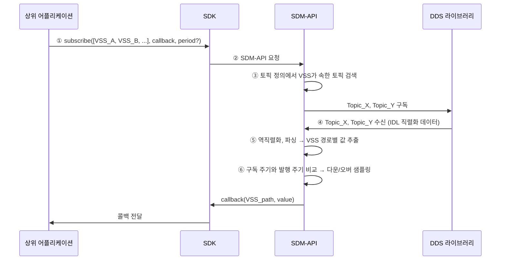
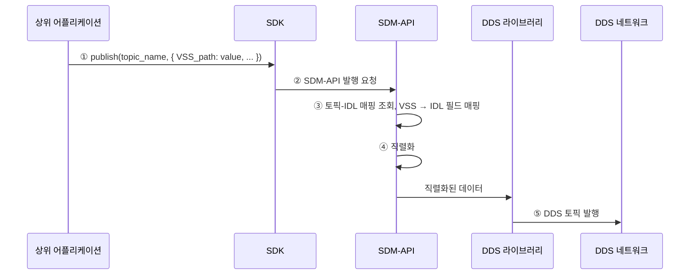

# SDM-DDS 시스템 아키텍처

DDS 통신 기반 VSS(Vehicle Signal Specification) 구독/발행 시스템의 기본 아키텍처 설계 문서입니다.

---

## 1. 개요

이 시스템은 상위 어플리케이션이 **VSS 경로**를 기준으로 신호를 구독/발행하고, 내부적으로 **DDS(DATA-DISTRIBUTION SERVICE)** 를 통해 실제 데이터를 전달하는 구조입니다. DDS 통신은 별도 라이브러리에 위임하여 관심사를 분리합니다.

---

## 2. 구성 요소

```mermaid
flowchart TB
    subgraph App["상위 어플리케이션 (Upper Application)"]
        A[VSS 경로로 구독/발행 요청<br/>Human-Readable]
    end

    subgraph SDK["SDK (Client Library)"]
        B[subscribe(vss_paths, callback, period?)<br/>publish(topic, vss_data)]
    end

    subgraph SDM["SDM-API (SDM Data API)"]
        C[VSS ↔ Topic 매핑 관리<br/>직렬화/역직렬화<br/>샘플링 제어<br/>DDS 래핑]
    end

    subgraph DDSLib["DDS 라이브러리 (별도 모듈)"]
        D[IDL 기반 직렬화 데이터 송수신<br/>QoS, Discovery 처리]
    end

    subgraph Network["DDS 네트워크"]
        E[DDS]
    end

    A --> B
    B --> C
    C --> D
    D --> E
```

---

## 3. 타입 및 토픽 정의

### 3.1 DDS 타입 (IDL)

- DDS 메시지의 구조는 **IDL(Interface Definition Language)** 로 정의한다.
- IDL로 정의된 타입은 DDS 미들웨어에 의해 직렬화/역직렬화된다.
- 예: `VehicleSignals.idl`, `ChassisData.idl` 등

### 3.2 토픽 정의 (CSV / XML / YAML)

- **토픽명**, **연계 IDL 타입**, **토픽에 포함된 VSS 경로 목록**은 다음 형식으로 관리한다:
  - **CSV**: 스프레드시트 호환, 단순 매핑에 적합
  - **XML**: 스키마 검증, 구조화된 메타데이터에 적합
  - **YAML**: 가독성, 설정·설정 파일에 적합
- 토픽 정의 예 (YAML):

```yaml
topics:
  - name: Vehicle.Chassis.Speed
    idl_type: ChassisData
    vss_paths:
      - Vehicle.Chassis.Speed
      - Vehicle.Chassis.Accelerator
```

---

## 4. 구독(Subscription) 플로우



### 4.1 단계별 상세

| 단계 | 담당 | 설명 |
|------|------|------|
| 1 | 상위 앱 | 구독할 VSS 경로 목록, 콜백, (선택) 구독 주기를 SDK에 전달 |
| 2 | SDK | SDM-API에 VSS 기반 구독 요청 전송 |
| 3 | SDM-API | 토픽 정의(CSV/XML/YAML)를 조회하여 VSS가 속한 토픽 식별 후 해당 토픽 구독 |
| 4 | DDS 라이브러리 | IDL 직렬화된 데이터 수신 |
| 5 | SDM-API | 역직렬화 및 파싱 후 VSS 경로에 해당하는 값만 추출 |
| 6 | SDM-API | 요청 구독 주기와 DDS 토픽 발행 주기 비교 후 다운/오버 샘플링 수행 |
| 7 | SDK | 콜백을 통해 상위 앱에 VSS 단위로 전달 |

### 4.2 샘플링 정책

- **구독 주기 > DDS 발행 주기**: 다운 샘플링 (예: 100Hz → 10Hz)
- **구독 주기 < DDS 발행 주기**: 오버 샘플링 (예: 보간, 마지막값 유지 등)
- 정책은 SDM-API 설정으로 제어 가능하도록 설계

---

## 5. 발행(Publish) 플로우



### 5.1 단계별 상세

| 단계 | 담당 | 설명 |
|------|------|------|
| 1 | 상위 앱 | 토픽명과 해당 토픽의 IDL에 속한 VSS 신호를 담아 SDK에 발행 요청 |
| 2 | SDK | SDM-API에 발행 요청 전송 |
| 3 | SDM-API | 토픽 정의에서 IDL 타입 및 VSS↔필드 매핑 조회 |
| 4 | SDM-API | VSS 값을 IDL 구조체로 변환 후 직렬화 |
| 5 | DDS 라이브러리 | 직렬화된 데이터를 DDS 토픽으로 발행 |

---

## 6. VSS 기반 발행 요청 vs DDS 발행 구조 최적화 (연구 과제)

현재 요구사항: **VSS로 발행 요청하고 DDS로 실제 발행**하는 구조에 대한 최적 방법론 연구.

### 6.1 고려 사항

| 항목 | 설명 |
|------|------|
| **토픽 경계** | VSS 하나가 여러 DDS 토픽에 걸칠 수 있는지, 아니면 1:1 매핑인지 |
| **부분 발행** | 토픽의 일부 VSS만 변경해 발행할 때, 나머지 필드 처리 (기본값, 이전값 유지 등) |
| **검증** | VSS 경로가 해당 토픽의 IDL에 정의된지 런타임/빌드타임 검증 |
| **성능** | VSS 단위 발행 vs 토픽 단위 일괄 발행 시 오버헤드 비교 |

### 6.2 후보 방법론

1. **토픽 중심 발행 (현재 설계)**
   - 앱은 항상 `(topic_name, vss_data)` 형태로 요청
   - SDM-API가 토픽↔VSS 매핑을 관리하고 직렬화 담당

2. **VSS 중심 발행 (대안)**
   - 앱은 `publish(vss_path, value)` 형태로 요청
   - SDM-API가 VSS 경로로 토픽을 역추적하여 적절한 토픽에 매핑
   - 단일 VSS만 발행할 때는 해당 토픽의 나머지 필드에 대한 정책 필요

3. **배치 발행**
   - 여러 VSS를 한 번에 발행할 때, 토픽별로 그룹핑하여 최소한의 DDS publish 호출로 처리

### 6.3 권장 방향 (초안)

- **구독**: VSS 중심 (앱은 VSS만 알면 됨)
- **발행**: 토픽 중심 + VSS 데이터
  - 토픽 경계를 앱이 인지해야 타입 안전성 확보
  - IDL과 VSS 매핑은 빌드/설정 타임에 검증
- **추가 연구**: VSS 중심 발행 시 토픽 자동 역추적 및 부분 업데이트 정책

---

## 7. 디렉터리 구조 (제안)

```
dds/
├── ARCHITECTURE.md          # 본 문서
├── idl/                     # IDL 타입 정의
│   └── *.idl
├── topics/                  # 토픽 정의 (CSV, XML, YAML)
│   ├── topics.yaml
│   └── vss_topic_mapping.csv
├── sdm_api/                 # SDM-API 구현
│   ├── subscriber.py
│   ├── publisher.py
│   └── mapping.py
├── sdk/                     # 클라이언트 SDK
│   └── ...
└── dds_lib/                 # DDS 래퍼 (또는 외부 라이브러리 참조)
    └── ...
```

---

## 8. 의존성 및 인터페이스

| 구성 요소 | 의존성 | 역할 |
|-----------|--------|------|
| 상위 어플리케이션 | SDK | VSS 구독/발행 요청 |
| SDK | SDM-API | API 호출, 콜백 전달 |
| SDM-API | DDS 라이브러리, 토픽 정의 | 매핑, 직렬화, 샘플링 |
| DDS 라이브러리 | IDL, DDS 미들웨어 | 실제 DDS 송수신 |

---

## 9. 추후 확장

- 토픽 정의 스키마 버전 관리
- QoS 설정 (신뢰성, 데드라인, 히스토리 등) VSS/토픽별 적용
- 보안 (DDS-Security, 인증/암호화) 연동
- 다중 도메인, 파티션 정책
