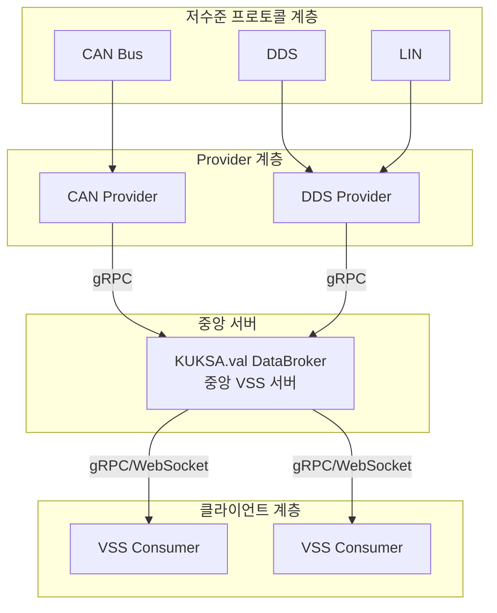
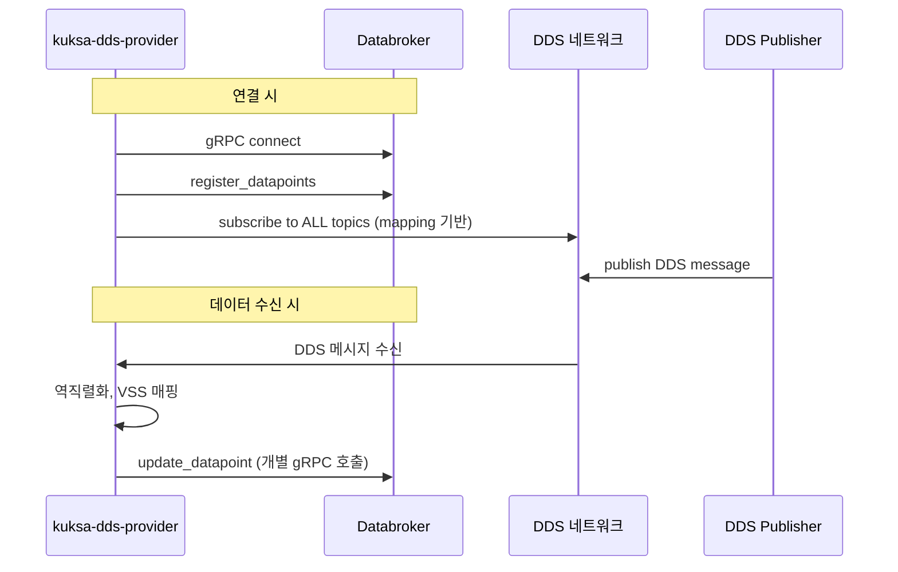
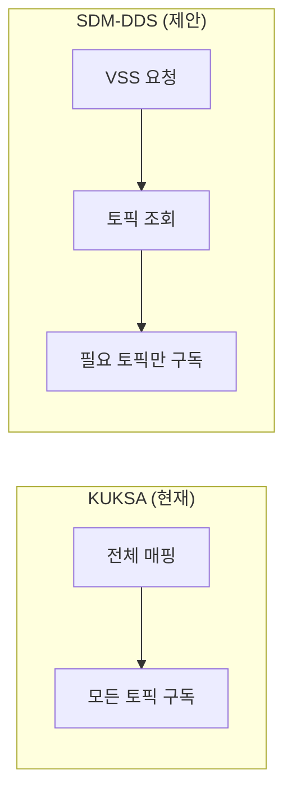
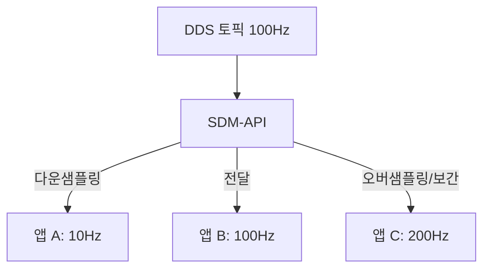
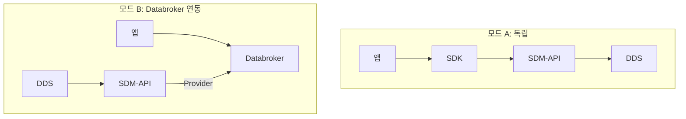

# SDM-DDS 아키텍처 개선 제안서

Eclipse KUKSA Databroker 및 kuksa-dds-provider 분석 결과를 바탕으로 SDM-DDS 아키텍처의 개선점을 도출하고 제안합니다.

---

## 1. Eclipse KUKSA 분석 요약

### 1.1 KUKSA Databroker 아키텍처



**Databroker 핵심 역할:**
- VSS 모델의 현재 상태 유지
- gRPC 기반 Get/Set/Subscribe/Actuate API 제공
- Provider로부터 데이터 수신, Consumer에게 데이터 제공
- JWT 기반 권한 관리 (구현 진행 중)

### 1.2 kuksa-dds-provider 아키텍처



**DDS Provider 특성:**
- **단방향**: DDS → Databroker만 지원 (Data Provider 역할)
- **매핑**: YAML 기반 `VSS_path → DDS_topic, element, typename, transform`
- **구독 방식**: 시작 시 매핑에 정의된 모든 DDS 토픽 구독
- **DDS 구현**: CycloneDDS 사용
- **발행 미지원**: VSS → DDS 발행 없음 (액추에이션 미지원)

---

## 2. KUKSA 한계 및 SDM-DDS 개선점

### 2.1 구조적 한계

| 구분 | KUKSA Databroker + DDS Provider | SDM-DDS 제안 |
|------|--------------------------------|--------------|
| **데이터 흐름** | DDS → Provider → Databroker → Consumer (3홉) | DDS → SDM-API → SDK → App (직접 전달) 또는 Databroker 연동 선택 |
| **구독 단위** | 앱은 VSS 구독 → Databroker가 모든 VSS 유지 | 앱은 VSS 구독 → SDM-API가 필요한 토픽만 구독 (온디맨드) |
| **발행** | DDS Provider는 발행 미지원 | VSS → DDS 발행 지원 설계 |
| **샘플링** | Databroker/Provider에 구독 주기 제어 없음 | 앱별 구독 주기 설정, 다운/오버 샘플링 지원 |
| **중앙 의존성** | Databroker 필수, 단일 장애점 | SDM-API는 Databroker 없이도 동작 가능 (설계 옵션) |

### 2.2 kuksa-dds-provider 구체적 한계

| 항목 | 현재 상태 | 개선 제안 |
|------|----------|----------|
| **매핑 구조** | VSS 중심 (각 VSS당 source 정의), 토픽별 통합 뷰 부재 | 토픽 중심 + VSS 목록 정의 (topics.yaml)로 토픽 단위 관리 |
| **토픽 구독** | 시작 시 매핑 내 전체 토픽 구독, 온디맨드 없음 | 요청된 VSS에 해당하는 토픽만 동적 구독 |
| **IDL 바인딩** | `eval(dataclass_name)` 사용 → 보안 리스크 | 사전 생성된 타입 레지스트리 또는 안전한 리플렉션 |
| **발행** | 미지원 | VSS→IDL 직렬화 후 DDS 발행 파이프라인 추가 |
| **변환 규칙** | formula (nominator/denominator/offset), math(수식) | 동일 유지 + 확장 가능한 transform 플러그인 |
| **다중 클라이언트** | Databroker가 중재, 클라이언트별 구독 주기 없음 | 클라이언트별 구독 주기, 필터링 분리 |

### 2.3 Databroker 연동 시 고려사항

- KUKSA 생태계 활용 시: SDM-API를 **DDS Provider**로 동작시키거나, **Databroker와 병렬**로 SDM-API를 두어 DDS 전용 경로 제공
- Databroker 미사용 시: SDM-API가 **독립 게이트웨이**로 앱 ↔ DDS 직접 중개

---

## 3. 아키텍처 개선 제안

### 3.1 제안 1: 온디맨드 토픽 구독

**현재 (KUKSA DDS Provider):** 매핑 파일에 정의된 모든 DDS 토픽을 시작 시 일괄 구독

**개선:** 앱이 요청한 VSS 목록 → 토픽 매핑 조회 → 해당 토픽만 구독



**효과:** 불필요한 DDS 트래픽 감소, 리소스 절약

### 3.2 제안 2: 구독 주기 및 샘플링

**현재 (KUKSA):** 구독 주기 제어 없음, Databroker가 가진 모든 업데이트 전달

**개선:** 앱별 `period` 파라미터 지원, DDS 발행 주기와 비교하여 다운/오버 샘플링



### 3.3 제안 3: VSS → DDS 발행 파이프라인

**현재 (KUKSA DDS Provider):** 발행 미지원

**개선:** 토픽명 + VSS 데이터 수신 → IDL 매핑 → 직렬화 → DDS 발행

| 발행 모델 | 설명 |
|----------|------|
| **토픽 중심** | `publish(topic_name, {vss_path: value, ...})` — 앱이 토픽을 알고 있음 |
| **VSS 중심** | `publish({vss_path: value, ...})` — SDM-API가 VSS→토픽 역매핑 |
| **배치** | 여러 VSS를 토픽별로 그룹핑 후 최소 DDS publish 호출 |

### 3.4 제안 4: 토픽 정의 포맷 표준화

**현재 (KUKSA):** VSS당 source(dds_topic, element, typename) 반복

**개선:** 토픽 중심 정의로 중복 제거 및 일관성 확보

```yaml
# 토픽 중심 정의 (제안)
topics:
  - name: Nav_Sat_Fix
    idl_type: sensor_msgs.msg.NavSatFix
    vss_mapping:
      Vehicle.CurrentLocation.Latitude: { element: latitude }
      Vehicle.CurrentLocation.Longitude: { element: longitude }
      Vehicle.CurrentLocation.Altitude: { element: altitude }
```

### 3.5 제안 5: IDL 타입 바인딩 안전화

**현재 (kuksa-dds-provider):** `eval(dataclass_name)`으로 런타임 타입 로드

**개선:**
- IDL → Python dataclass 사전 생성
- 토픽명/타입명 → dataclass 레지스트리 매핑
- `eval` 제거, 안전한 `registry[typename]` 방식 사용

### 3.6 제안 6: KUKSA Databroker 연동 모드



- **모드 A**: SDM-API가 앱과 직접 통신, Databroker 불필요
- **모드 B**: SDM-API를 DDS Provider로 활용, Databroker에 데이터 공급

---

## 4. 개선 항목 우선순위

| 순위 | 개선 항목 | 기대 효과 | 구현 난이도 |
|------|----------|----------|-------------|
| 1 | VSS → DDS 발행 지원 | 양방향 통신 완성 | 중 |
| 2 | 온디맨드 토픽 구독 | 리소스 절감 | 중 |
| 3 | 구독 주기/샘플링 | 앱 요구사항 충족 | 중 |
| 4 | IDL 바인딩 안전화 | 보안 강화 | 하 |
| 5 | 토픽 정의 표준화 | 유지보수성 향상 | 하 |
| 6 | Databroker 연동 모드 | KUKSA 생태계 호환 | 중 |

---

## 5. 참고: KUKSA 소스 분석 요약

### 5.1 kuksa-dds-provider 핵심 파일

| 파일 | 역할 |
|------|------|
| `ddsprovider.py` | 진입점, 환경 변수, Ddsprovider 시작 |
| `helper.py` | Ddsprovider, DdsListener, DomainParticipant, DataReader, gRPC 연결 |
| `vss2ddsmapper.py` | YAML 매핑 로드, DDS→VSS 변환, formula/math transform |
| `databroker.py` | Provider 클래스, register, update_datapoint (gRPC set) |
| `mapping/*.yml` | VSS 경로별 source (dds_topic, element, typename, transform) |

### 5.2 매핑 예시 (mapping.yml)

```yaml
Vehicle.CurrentLocation.Latitude:
  source:
    Nav_Sat_Fix:
      typename: sensor_msgs.msg.NavSatFix
      element: latitude
      transform: { formula: { nominator: 1, denominator: 1, offset: 0 } }
```

### 5.3 데이터 흐름 (DdsListener.on_data_available)

1. `reader.take_next()` → DDS 샘플 수신
2. `mapper.dds2vss_dict[topic_name]` → 해당 토픽의 VSS 목록 조회
3. `getattr(data, element)` → IDL 필드에서 값 추출
4. `mapper.transform()` → formula 적용
5. `provider.update_datapoint(vss_signal, value)` → gRPC set 호출

---

## 6. 결론

Eclipse KUKSA Databroker와 kuksa-dds-provider는 VSS 기반 차량 데이터 통합의 실사용 참조 구현이지만, **단방향 구독**, **전체 토픽 일괄 구독**, **구독 주기 미지원**, **발행 미지원** 등 제약이 있습니다. SDM-DDS 아키텍처는 이를 보완하여 **양방향 통신**, **온디맨드 구독**, **주기/샘플링 제어**, **토픽/VSS 매핑 표준화**를 목표로 설계할 수 있습니다. KUKSA 생태계와의 연동은 SDM-API를 Databroker의 DDS Provider로 동작시키는 모드를 추가하는 것으로 달성 가능합니다.
