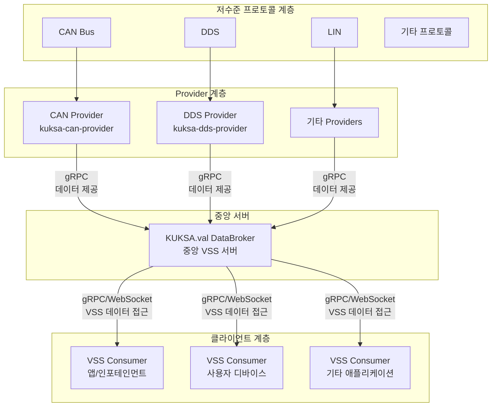
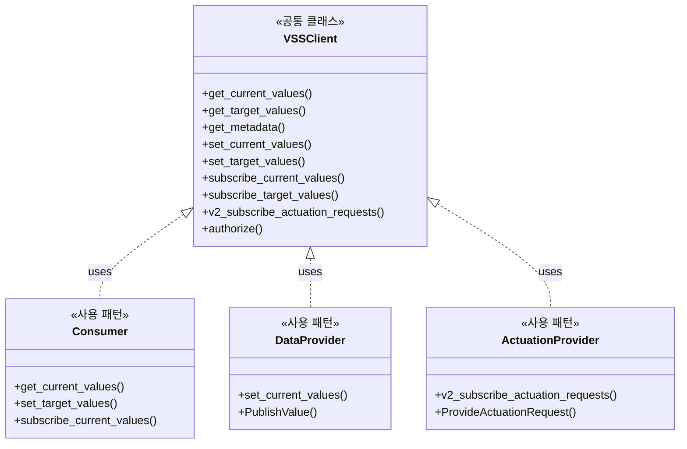
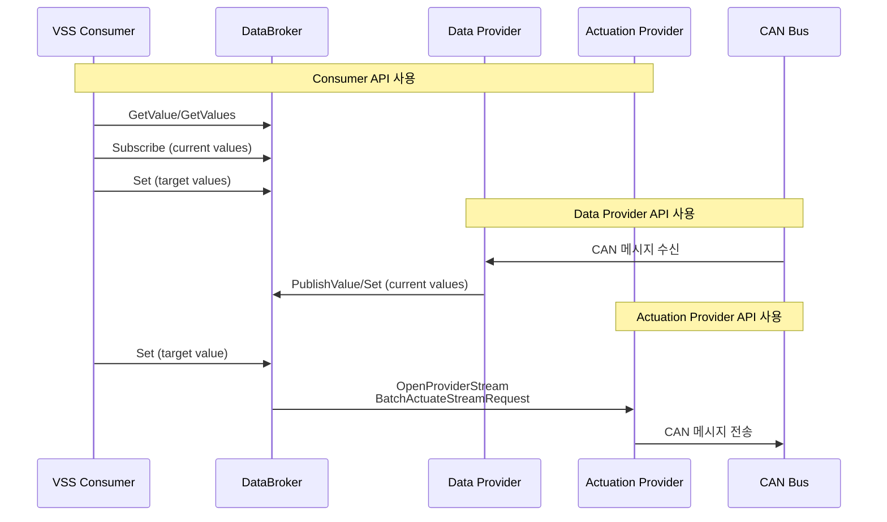

# KUKSA.val 아키텍처 개요

## 1. 전체 아키텍처



## 2. DataBroker의 역할

**DataBroker는 중앙에 위치한 VSS 서버**로 다음 역할을 수행합니다:

1. **VSS 모델 관리**: 모든 VSS 신호의 현재 상태를 유지
2. **API 제공**: gRPC/WebSocket을 통한 VSS 데이터 접근 API
3. **권한 관리**: 클라이언트의 VSS 신호 접근 권한 검증
4. **데이터 동기화**: Providers로부터 실제 차량 상태를 받아 VSS 모델 업데이트
5. **액추에이션 관리**: Consumer의 액추에이션 요청을 Provider에 전달

## 3. Provider의 역할

**Providers는 저수준 프로토콜에서 데이터를 가져와 DataBroker에 제공**합니다:

### Data Provider (데이터 제공자)
- **역할**: 실제 차량 상태를 VSS 모델에 반영
- **예시**: CAN Provider가 CAN 버스에서 속도 신호를 읽어 `Vehicle.Speed` 업데이트
- **방향**: 저수준 프로토콜 → DataBroker

### Actuation Provider (액추에이션 제공자)
- **역할**: VSS 액추에이터의 target 값을 실제 하드웨어에 반영
- **예시**: CAN Provider가 `Vehicle.Body.Trunk.Rear.IsOpen`의 target 값 변경을 감지하고 CAN으로 트렁크 열기 명령 전송
- **방향**: DataBroker → 저수준 프로토콜

## 4. SDK의 클라이언트/프로바이더 API 구분

### 구조적 구분

**같은 `VSSClient` 클래스를 사용하지만, 용도에 따라 다른 메서드를 호출합니다:**



### API 분류

#### 1. Consumer (클라이언트) 전용 API

```python
# VSS 데이터 읽기
client.get_current_values(paths)      # 현재 값 조회
client.get_target_values(paths)      # 타겟 값 조회 (액추에이터)
client.get_metadata(paths)           # 메타데이터 조회

# VSS 데이터 구독
client.subscribe_current_values(paths)  # 현재 값 변경 구독
client.subscribe_target_values(paths)  # 타겟 값 변경 구독

# 액추에이션 요청
client.set_target_values(updates)   # 액추에이터 타겟 값 설정
```

#### 2. Data Provider 전용 API

```python
# VSS 센서/속성 값 업데이트
client.set_current_values(updates)  # 내부적으로 PublishValue 사용 (v2)
# 또는 직접 v2 PublishValue 호출
```

**사용 예시 (CAN Provider):**
```python
# CAN에서 읽은 속도 값을 VSS에 업데이트
client.set_current_values({
    'Vehicle.Speed': Datapoint(value=60.5)
})
```

#### 3. Actuation Provider 전용 API

```python
# 액추에이터 제공 등록 및 액추에이션 요청 구독
client.v2_subscribe_actuation_requests(paths)
# 내부적으로 OpenProviderStream + ProvideActuationRequest 사용
```

**사용 예시 (CAN Provider):**
```python
# 액추에이터 제공 등록 및 구독
async for updates in client.v2_subscribe_actuation_requests([
    'Vehicle.Body.Trunk.Rear.IsOpen'
]):
    for update in updates:
        # target 값 변경 감지 → CAN으로 전송
        can_value = transform_to_can(update.entry.actuator_target.value)
        can_client.send(can_value)
```

### 프로토콜 레벨 구분



### 실제 코드에서의 구분

#### CAN Provider의 사용 예시

**Data Provider 역할:**
```python
# dbcfeederlib/databrokerclientwrapper.py
def update_datapoint(self, name: str, value: Any) -> bool:
    # set_current_values 내부적으로 PublishValue 사용
    updates = (EntryUpdate(DataEntry(
        name,
        value=Datapoint(value=value),
        metadata=Metadata(data_type=self._name_to_type[name]),
    ), (Field.VALUE,)),)
    self._grpc_client.set(updates=updates, **self._rpc_kwargs)
```

**Actuation Provider 역할:**
```python
# dbcfeeder.py
async def subscribe(self, vss_names: List[str], callback):
    entries: List[SubscribeEntry] = []
    for name in vss_names:
        subscribe_entry = SubscribeEntry(name, View.FIELDS, [Field.ACTUATOR_TARGET])
        entries.append(subscribe_entry)
    
    async with VSSClient(...) as client:
        async for updates in client.subscribe(entries=entries):
            await callback(updates)
```

## 5. gRPC 프로토콜 레벨 구분

### Consumer용 RPC
- `GetValue` / `GetValues` - 값 조회
- `Subscribe` / `SubscribeById` - 값 변경 구독
- `Actuate` / `BatchActuate` - 액추에이션 요청

### Provider용 RPC
- `PublishValue` - 센서/속성 값 게시 (저주파)
- `OpenProviderStream` - 프로바이더 스트림 (고주파 + 액추에이션)
  - `ProvideActuationRequest` - 액추에이터 제공 등록
  - `PublishValuesRequest` - 고주파 값 게시
  - `BatchActuateStreamRequest` - 액추에이션 요청 수신

## 6. 요약

### 아키텍처
✅ **맞습니다!** DataBroker가 중앙에 위치하고, Providers가 저수준 프로토콜에서 데이터를 DataBroker에 제공하는 구조입니다.

### SDK API 구분
✅ **구분됩니다!** 하지만 별도 클래스가 아니라 **같은 `VSSClient` 클래스에 용도별 메서드가 제공**됩니다:

- **Consumer용**: `get_*`, `subscribe_*`, `set_target_values`
- **Data Provider용**: `set_current_values` (내부적으로 `PublishValue`)
- **Actuation Provider용**: `v2_subscribe_actuation_requests` (내부적으로 `OpenProviderStream`)

### 프로토콜 레벨 구분
- **Consumer**: 일반적인 Get/Set/Subscribe RPC 사용
- **Provider**: `PublishValue` 및 `OpenProviderStream` RPC 사용

이러한 구분을 통해 같은 SDK를 사용하면서도 역할에 맞는 API를 선택적으로 사용할 수 있습니다.

